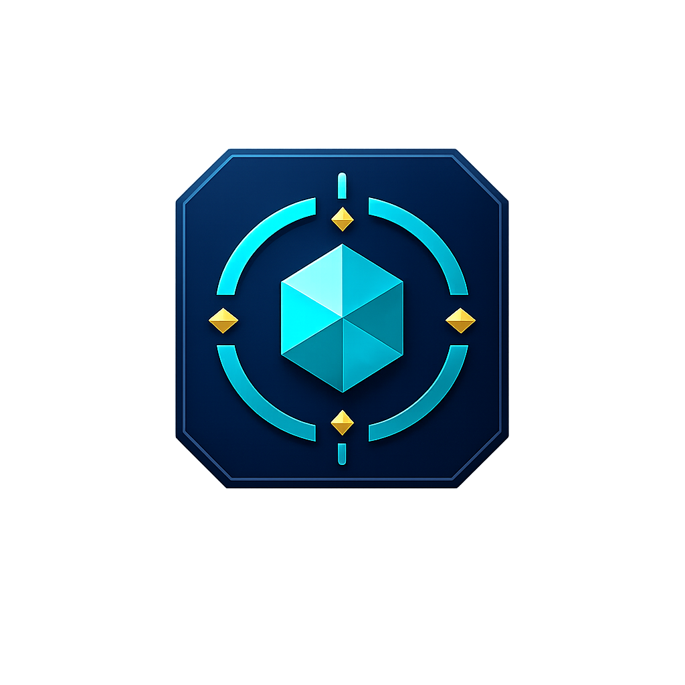

<p align="center">
  
</p>

<h1 align="center">LoL Profile Manager</h1>

<p align="center">
  <a href="https://github.com/duyanhdo10/lol-profile-manager/actions/workflows/ci.yml"></a>
  <a href="https://github.com/duyanhdo10/lol-profile-manager/releases"></a>
  <a href="LICENSE"></a>
</p>

<p align="center">
  <a href="#english">English</a> · <a href="#tiếng-việt">Tiếng Việt</a>
</p>

---

## English

LoL Profile Manager is an open-source Windows desktop application for previewing, reviewing, and applying
League Client social-profile appearance changes.

> [!WARNING]
> The application uses LCU, a local API that is not officially supported by Riot Games and may change with a
> League Client update.

### Features

- Browse profile icons and champion skin splash backgrounds from CommunityDragon.
- Build a showcase with a challenge title, up to three ordered challenge tokens, and a challenge banner.
- Configure profile regalia separately from showcase banners.
- View real Solo/Duo, Flex, and TFT rank snapshots with CommunityDragon ranked emblems.
- Edit all three rank displays while choosing exactly one queue to publish to the hovercard.
- Preview the current and proposed profile in a Riot-style overview before applying.
- Review a six-step transaction: background → icon → showcase → regalia → status → rank.
- Stop on the first failed step and roll completed steps back in reverse order.
- Browse a cache-first catalog offline with patch, ownership, compatibility, and locale-fallback indicators.
- Use English or Vietnamese without losing ID-based draft selections.
- Check GitHub Releases automatically, download updates in the background, and install only after you choose
  **Restart and update**.

The application does not purchase, unlock, or grant ownership of content, and it never changes gameplay or
ranked progression. Unowned items remain available for preview, but the League Client may reject them.
Transient status and hovercard values are never reapplied automatically after reconnecting.

### Automatic updates

Starting with v0.1.0-beta.4, the packaged app checks GitHub Releases shortly after launch. You can also check
manually from the sidebar. A new installer downloads in the background, but the app never restarts or installs
it without an explicit action. If a profile draft or review is open, the restart confirmation warns that those
pending selections will be lost.

The update client uses the release metadata and SHA-512 checksum produced by electron-builder. This beta is
not code-signed yet, so Windows may still display a SmartScreen warning. The updater contains no GitHub token;
release publishing uses GitHub Actions' short-lived repository token.

### Requirements and development

- Windows x64.
- League of Legends and the League Client. A running client is only required for a live read or apply.
- For development: Node.js 24.18.x and npm 11 or newer.

```powershell
npm ci
npm run dev
```

If PowerShell blocks npm.ps1, use npm.cmd. The main project commands are:

| Command               | Purpose                                                 |
| --------------------- | ------------------------------------------------------- |
| npm run format        | Format source and configuration files                   |
| npm run lint          | Run ESLint for TypeScript and React                     |
| npm run lint:css      | Run Stylelint for CSS Modules                           |
| npm run typecheck     | Type-check renderer and Electron code                   |
| npm test              | Run unit, integration, and renderer tests               |
| npm run test:e2e      | Build and run Electron end-to-end tests                 |
| npm run verify        | Run the verification pipeline and production build      |
| npm run package       | Create the Windows x64 NSIS installer in release/       |
| npm run audit:runtime | Check runtime dependencies for critical vulnerabilities |

### Architecture and security

```text
electron/                 Secure main process, LCU, catalog, IPC, apply and rollback
src/shared/models/        Contracts shared by main, preload, renderer and tests
src/renderer/             React UI, i18n, pages, lifecycle and Zustand state
tests/                    Unit, integration, renderer and Electron E2E suites
```

The renderer runs with Node integration disabled, context isolation enabled, and Chromium sandboxing enabled.
LCU credentials, filesystem access, and remote network access remain in the Electron main process. The
renderer communicates only through the typed preload bridge. Remote images are allowlisted and proxied from
raw.communitydragon.org; the application has no telemetry.

Catalog names, descriptions, and artwork come from
[CommunityDragon](https://communitydragon.org/). Artwork uses global/default; Vietnamese metadata uses
global/vi_vn with per-file fallback to English.

LoL Profile Manager is a community project and is not developed, sponsored, or endorsed by Riot Games.
League of Legends and Riot Games are trademarks of Riot Games, Inc. Released under the [MIT License](LICENSE).

---

## Tiếng Việt

LoL Profile Manager là ứng dụng desktop mã nguồn mở cho Windows, giúp xem trước, kiểm tra và áp dụng các thay
đổi về diện mạo hồ sơ xã hội trong League Client.

> [!WARNING]
> Ứng dụng sử dụng LCU, một API cục bộ không được Riot Games hỗ trợ chính thức và có thể thay đổi sau mỗi bản
> cập nhật League Client.

### Tính năng

- Duyệt biểu tượng hồ sơ và ảnh nền splash trang phục tướng từ CommunityDragon.
- Tạo Showcase gồm danh hiệu thử thách, tối đa ba token có thứ tự và banner thử thách.
- Cấu hình regalia hồ sơ độc lập với banner Showcase.
- Xem hạng thật của Đơn/Đôi, Linh Hoạt và ĐTCL bằng huy hiệu hạng từ CommunityDragon.
- Chỉnh cả ba hạng trong bản nháp nhưng chỉ chọn đúng một hàng chờ để hiển thị trên hovercard.
- So sánh hồ sơ hiện tại và sau thay đổi bằng bản xem trước phong cách Riot.
- Kiểm tra giao dịch sáu bước: ảnh nền → biểu tượng → Showcase → regalia → trạng thái → hạng.
- Dừng ở lỗi đầu tiên và hoàn tác các bước đã hoàn thành theo thứ tự ngược.
- Duyệt catalog cache-first khi ngoại tuyến, kèm trạng thái patch, sở hữu, tương thích và fallback ngôn ngữ.
- Dùng tiếng Anh hoặc tiếng Việt mà không mất lựa chọn bản nháp theo ID.
- Tự động kiểm tra GitHub Releases, tải cập nhật trong nền và chỉ cài khi bạn chọn **Khởi động lại và cập nhật**.

Ứng dụng không mua, mở khóa hoặc cấp quyền sở hữu nội dung, đồng thời không thay đổi gameplay hay tiến trình
xếp hạng. Vật phẩm chưa sở hữu vẫn có thể xem trước nhưng League Client có thể từ chối khi áp dụng. Trạng thái
và hạng hovercard tạm thời không bao giờ được tự động áp dụng lại sau khi kết nối lại.

### Cập nhật tự động

Từ v0.1.0-beta.4, bản ứng dụng đã đóng gói sẽ kiểm tra GitHub Releases ngay sau khi mở. Bạn cũng có thể kiểm
tra thủ công từ thanh bên. Bộ cài mới được tải trong nền, nhưng ứng dụng không tự khởi động lại hoặc cài đặt
nếu chưa có thao tác xác nhận. Khi đang có bản nháp hoặc cửa sổ kiểm tra, hộp thoại khởi động lại sẽ cảnh báo
rằng các lựa chọn chưa áp dụng sẽ bị mất.

Trình cập nhật xác minh metadata phát hành và checksum SHA-512 do electron-builder tạo. Bản beta hiện chưa
được ký mã nên Windows vẫn có thể hiển thị cảnh báo SmartScreen. Ứng dụng không chứa GitHub token; quá trình
phát hành dùng token kho lưu trữ ngắn hạn của GitHub Actions.

### Yêu cầu và phát triển

- Windows x64.
- League of Legends và League Client. Chỉ cần mở client khi đọc hoặc áp dụng hồ sơ trực tiếp.
- Để phát triển: Node.js 24.18.x và npm 11 trở lên.

```powershell
npm ci
npm run dev
```

Nếu PowerShell chặn npm.ps1, hãy dùng npm.cmd. Các lệnh chính:

| Lệnh                  | Mục đích                                               |
| --------------------- | ------------------------------------------------------ |
| npm run format        | Định dạng source và tệp cấu hình                       |
| npm run lint          | Chạy ESLint cho TypeScript và React                    |
| npm run lint:css      | Chạy Stylelint cho CSS Modules                         |
| npm run typecheck     | Kiểm tra kiểu dữ liệu renderer và Electron             |
| npm test              | Chạy unit, integration và renderer tests               |
| npm run test:e2e      | Build và chạy Electron end-to-end tests                |
| npm run verify        | Chạy pipeline kiểm tra và production build             |
| npm run package       | Tạo bộ cài NSIS Windows x64 trong release/             |
| npm run audit:runtime | Kiểm tra lỗ hổng nghiêm trọng trong dependency runtime |

### Kiến trúc và bảo mật

```text
electron/                 Main process bảo mật, LCU, catalog, IPC, apply và rollback
src/shared/models/        Contract dùng chung cho main, preload, renderer và test
src/renderer/             React UI, i18n, trang, lifecycle và Zustand state
tests/                    Unit, integration, renderer và Electron E2E
```

Renderer tắt Node integration, bật context isolation và Chromium sandbox. Credential LCU, filesystem và truy
cập mạng từ xa luôn nằm trong Electron main process. Renderer chỉ giao tiếp qua preload bridge có kiểu dữ
liệu. Ảnh từ xa chỉ được proxy qua allowlist raw.communitydragon.org; ứng dụng không có telemetry.

Tên, mô tả và artwork catalog đến từ [CommunityDragon](https://communitydragon.org/). Artwork dùng
global/default; metadata tiếng Việt dùng global/vi_vn và fallback riêng từng tệp sang tiếng Anh.

LoL Profile Manager là dự án cộng đồng, không do Riot Games phát triển, tài trợ hoặc chứng thực. League of
Legends và Riot Games là nhãn hiệu của Riot Games, Inc. Dự án phát hành theo [Giấy phép MIT](LICENSE).
